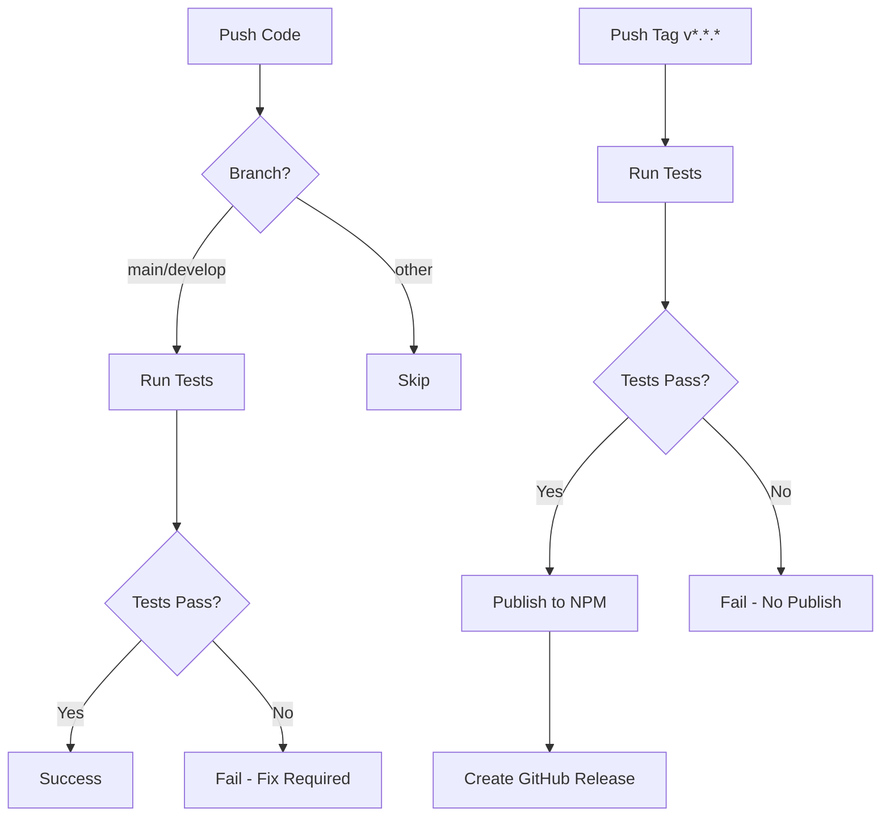

# GitHub Actions Setup Guide

This guide explains how to configure GitHub Actions for automated testing and NPM publishing.

## Prerequisites

1. GitHub repository created and code pushed
2. NPM account created at [npmjs.com](https://www.npmjs.com/)
3. Repository admin access

## Setup Steps

### 1. Configure NPM Token

To publish to NPM automatically, you need to create an access token:

1. **Create NPM Access Token**:
   - Go to [npmjs.com](https://www.npmjs.com/) and log in
   - Click your profile icon → "Access Tokens"
   - Click "Generate New Token" → "Classic Token"
   - Select "Automation" type (for CI/CD)
   - Copy the generated token

2. **Add Token to GitHub Secrets**:
   - Go to your GitHub repository
   - Navigate to: **Settings** → **Secrets and variables** → **Actions**
   - Click **New repository secret**
   - Name: `NPM_TOKEN`
   - Value: paste your NPM token
   - Click **Add secret**

### 2. Verify GitHub Token

The `GITHUB_TOKEN` is automatically provided by GitHub Actions and doesn't require setup. It's used to create GitHub releases.

### 3. Configure Repository Settings

Ensure the following repository settings are configured:

1. **Branch Protection** (optional but recommended):
   - Go to: **Settings** → **Branches**
   - Add rule for `main` branch
   - Enable "Require status checks to pass before merging"
   - Select the "test" workflow

2. **Actions Permissions**:
   - Go to: **Settings** → **Actions** → **General**
   - Ensure "Allow all actions and reusable workflows" is selected
   - Under "Workflow permissions", select "Read and write permissions"

## Workflows

### Test Workflow (`test.yml`)

**Trigger**: Runs on every push and pull request to `main` and `develop` branches

**What it does**:
- Runs tests on Node.js versions: 18.x, 20.x, 22.x
- Executes `npm test`
- Generates coverage report
- Uploads coverage to Codecov (optional)

**Manual trigger**:
```bash
# Push to main/develop
git push origin main

# Or create a pull request
```

### Publish Workflow (`publish.yml`)

**Trigger**: Runs when a version tag is pushed (format: `v*.*.*`)

**What it does**:
1. Runs all tests
2. Publishes package to NPM registry
3. Creates a GitHub release with the tag

**How to publish**:

```bash
# 1. Update version in package.json
npm version patch  # or minor, or major

# 2. Push the tag
git push origin main --tags

# Or manually create a tag
git tag v0.0.2
git push origin v0.0.2
```

**Version bumping**:
- `npm version patch`: 0.0.1 → 0.0.2 (bug fixes)
- `npm version minor`: 0.0.1 → 0.1.0 (new features)
- `npm version major`: 0.0.1 → 1.0.0 (breaking changes)

## Monitoring

### View Workflow Runs

1. Go to your GitHub repository
2. Click the **Actions** tab
3. See all workflow runs with status

### Check NPM Package

After successful publish:
- Visit: `https://www.npmjs.com/package/homebridge-tesy-heater-mqtt`
- Verify the new version is listed

### Troubleshooting

**Publish fails with "401 Unauthorized"**:
- Check that `NPM_TOKEN` secret is set correctly
- Verify token hasn't expired
- Ensure token has "Automation" permission

**Tests fail on push**:
- Check the Actions tab for detailed error logs
- Fix the failing tests
- Push the fix

**Tag already exists**:
```bash
# Delete local tag
git tag -d v0.0.1

# Delete remote tag
git push origin :refs/tags/v0.0.1

# Create new tag with correct version
git tag v0.0.2
git push origin v0.0.2
```

## Local Testing

Before pushing, test locally:

```bash
# Run tests
npm test

# Run tests with coverage
npm run test:coverage

# Verify package can be packed
npm pack

# Check what files will be published
npm publish --dry-run
```

## CI/CD Flow



## Best Practices

1. **Always test locally** before pushing
2. **Update version** using `npm version` command
3. **Write meaningful commit messages**
4. **Update CHANGELOG.md** before releases
5. **Test the published package** after release:
   ```bash
   npm install -g homebridge-tesy-heater-mqtt
   ```

## Security Notes

- Never commit NPM tokens to the repository
- Keep secrets in GitHub Secrets only
- Rotate tokens periodically
- Use Automation tokens (not Classic tokens) for CI/CD

## Additional Resources

- [GitHub Actions Documentation](https://docs.github.com/en/actions)
- [NPM Access Tokens](https://docs.npmjs.com/about-access-tokens)
- [Semantic Versioning](https://semver.org/)
